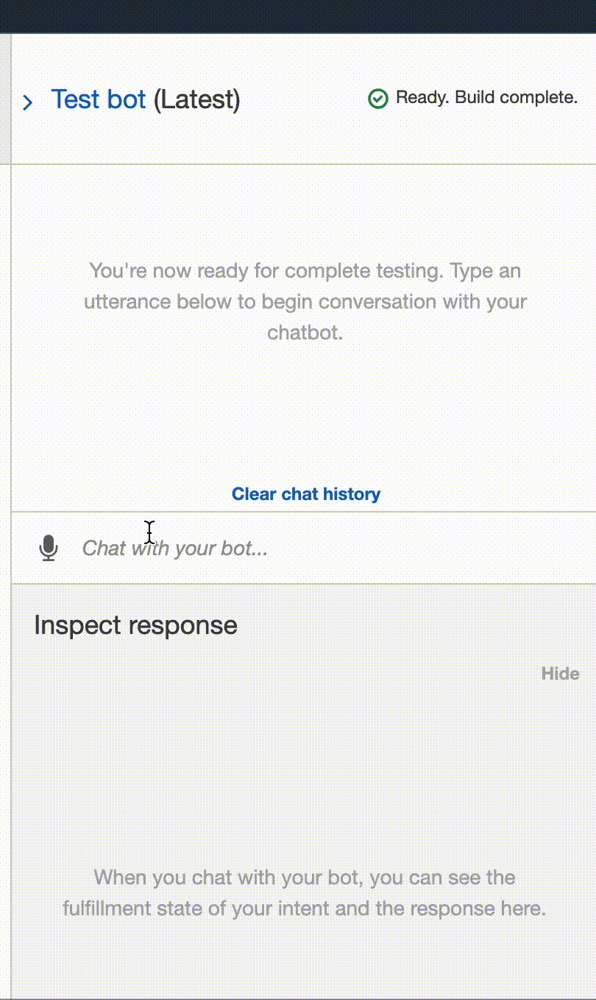

# Robo Investor
FinTech Challenge 15 - robo investing advisor  

---

## Overview
Robo-advisor is an implementation of a chat-bot using Amazon Lex and AWS Lambda, which will guide an investor towards an investment portfolio recommendation.  

## Assumptions & Process
The chat bot will use [AWS Lambda](https://docs.aws.amazon.com/lambda/latest/dg/welcome.html) and [Amazon Lex](https://docs.aws.amazon.com/lexv2/latest/dg/what-is.html).

**High-level steps:**  
- An [Amazon Lex](https://docs.aws.amazon.com/lexv2/latest/dg/what-is.html) bot will be configured with a single intent that establishes a conversation about investment requirements
- Chat bot will then be tested to ensure this is working properly
- Chat bot will be enhaced with a [lambda function](app/recommendPortfolio.py) that validates user input, and returns the portfolio recommendation.  

**Submission:**  
- Final [lambda function](app/recommendPortfolio.py)
- videos of testing and running chat bot (see below)

## ChatBot Test Validation and Actual Use

Test run of Amazon Lex setup:  
  

Actual run of Lex with Lambda handling the events to/from the Lex bot:  
  


---

## Technologies

This challenge uses [python](https://www.python.org/) 3.7 and the following modules:  
- [pathlib](https://docs.python.org/3/library/pathlib.html)
- [datetime](https://docs.python.org/3.7/library/datetime.html)
- [dateutil](https://dateutil.readthedocs.io/en/stable/)  

This challenges uses the following AWS technologies:  
- [AWS Lambda](https://docs.aws.amazon.com/lambda/latest/dg/welcome.html)
- [Amazon Lex](https://docs.aws.amazon.com/lexv2/latest/dg/what-is.html)  

See [installation](#installation) below for specifics.

---

## Installation

You will need Python 3.7, that supports for this application to run. An easy way to install python 3.7 is to download and install [Anaconda](https://www.anaconda.com/products/individual). After installing anaconda, open a terminal/command-prompt, and setup a python 3.7 environment, and then activate it like so:

```
# create an anaconda python 3.7 environment
# name can be any friendly name to refer to your environment, eg 'dev'
conda create --name dev python=3.7 anaconda

# activating the environment
conda activate dev

# use pip to install the above modules, eg:
pip install dateutil
...etc...
```

---

## Contributors

[David Lopez](https://github.com/sububer)

---

## License

MIT